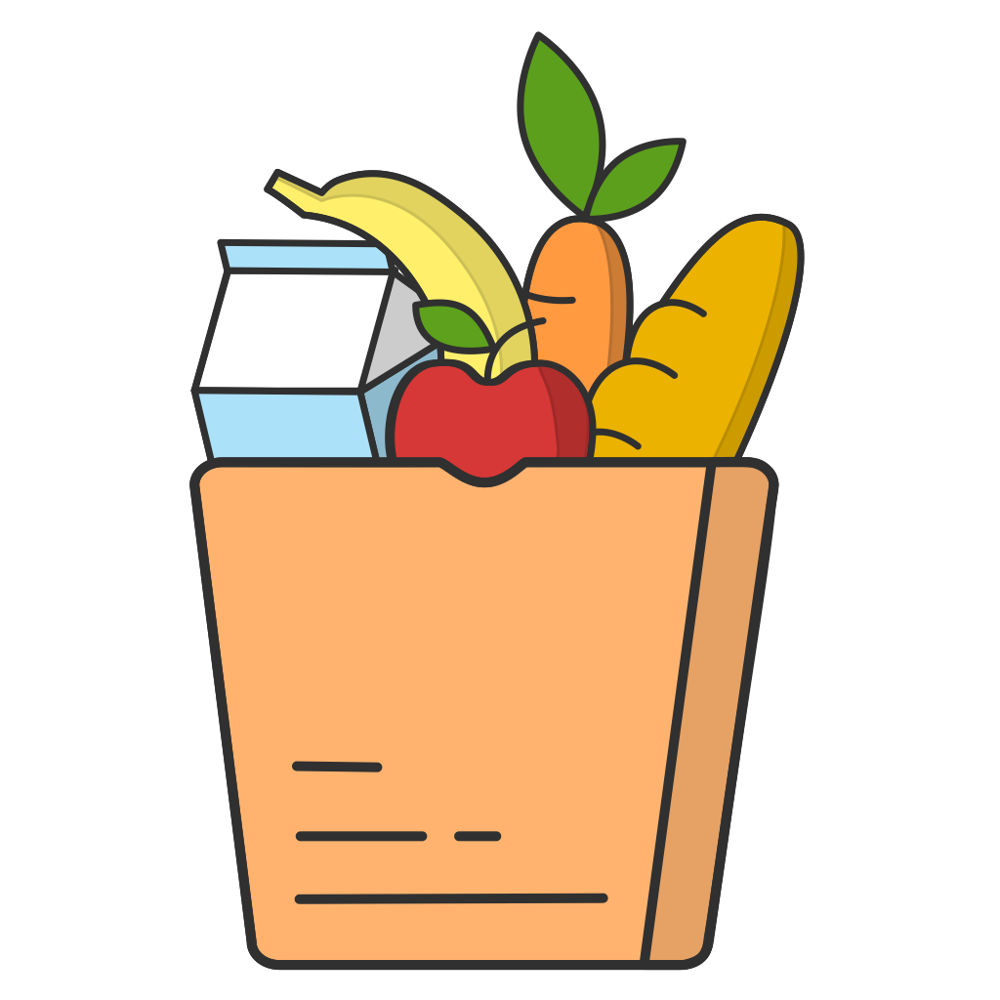

## ShoppingList App

The ”ShoppingList App” name speaks for itself. The simple, beautiful and convenient app will help you to make your shopping easier. It allows you quickly manage your shopping list and create new ones. You can share your lists to any messengers or edit them together with your family and friends in the app. Fast synchronization always keeps your lists up to date and will save your changes for your family or friends. A convenient system of categorization and custom sorting will help you to make your shopping faster. Write down in your device everything you need to buy in the store - and you will not lose or forget anything.

App features:
- EASY TO USE
- FREE AND WITHOUT ADS
- MULTIPLE SHOPPING LISTS
- QUICK ADDING
- AUTOMATIC AND FAST SYNCHRONIZATION
- CONVENIENT CATEGORIZATION
- CUSTOM SORTING 
- CLOUD STORAGE
- DARK AND LIGHT THEME SUPPORTED

### Contact us

[Telegram](https://t.me/shoppinglistappsupport)

**Email:** shoppinglistapp.help.io@gmail.com

[App Privacy Notice](https://srozhina.github.io/shoppinglistapp/privacy)
